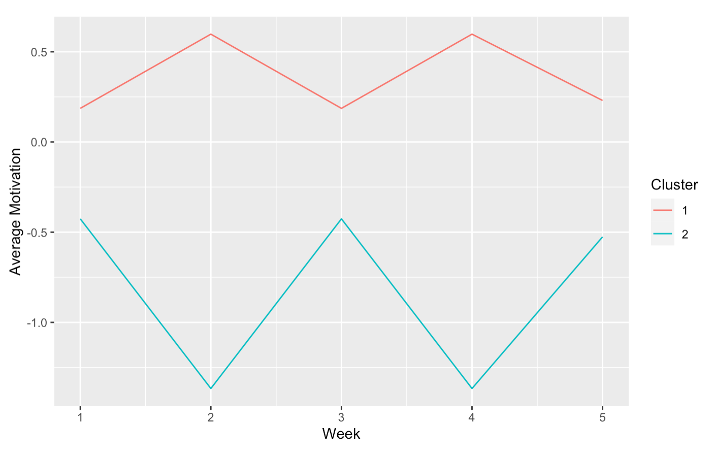
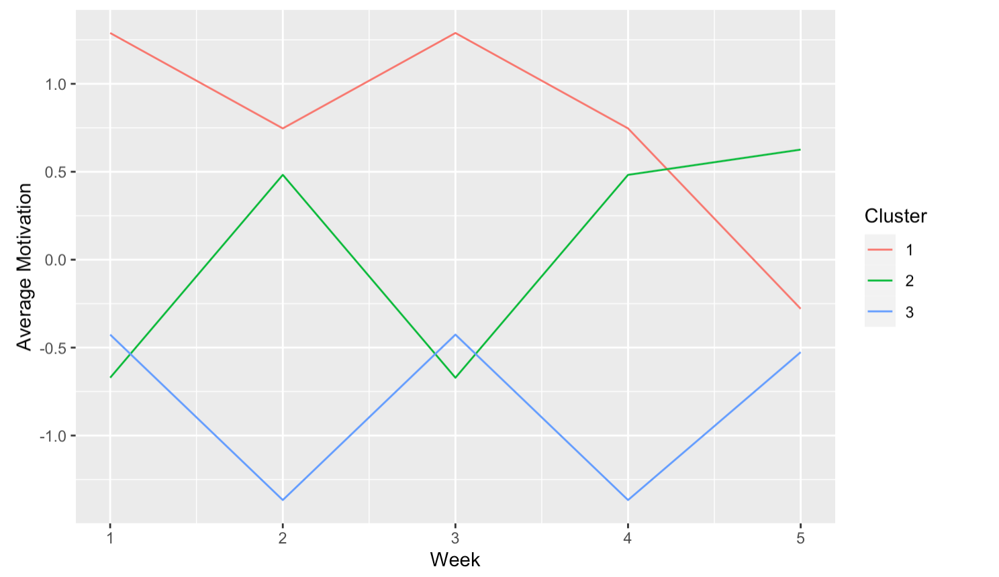
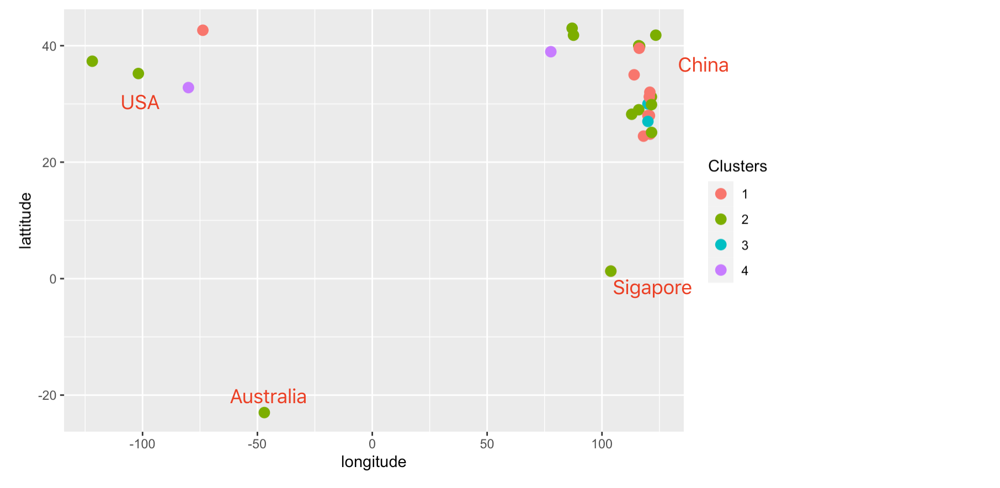

# Cluster-Analysis
Cluster analysis or clustering is the task of grouping a set of objects in such a way that objects in the same group (called a cluster) are more similar (in some sense) to each other than to those in other groups (clusters).

# Goals and tasks
- To use multiple survey data to group students
- Data sources are ： （1）Student course registration list (2) Students geographical location and past travel history

# Pacakges
`library(tidyr)` 
`library(dplyr)` 
`library(klaR)` 
`library(ggplot)`

# Results

Based on this this longtitude and latitude map, we could tell that students coming from the same place have more in common and are easily forming into clusters. To increase cultural exchange and activate classroom dynamics, it's better to have students from different clusters to team up for group work/ discussion.
